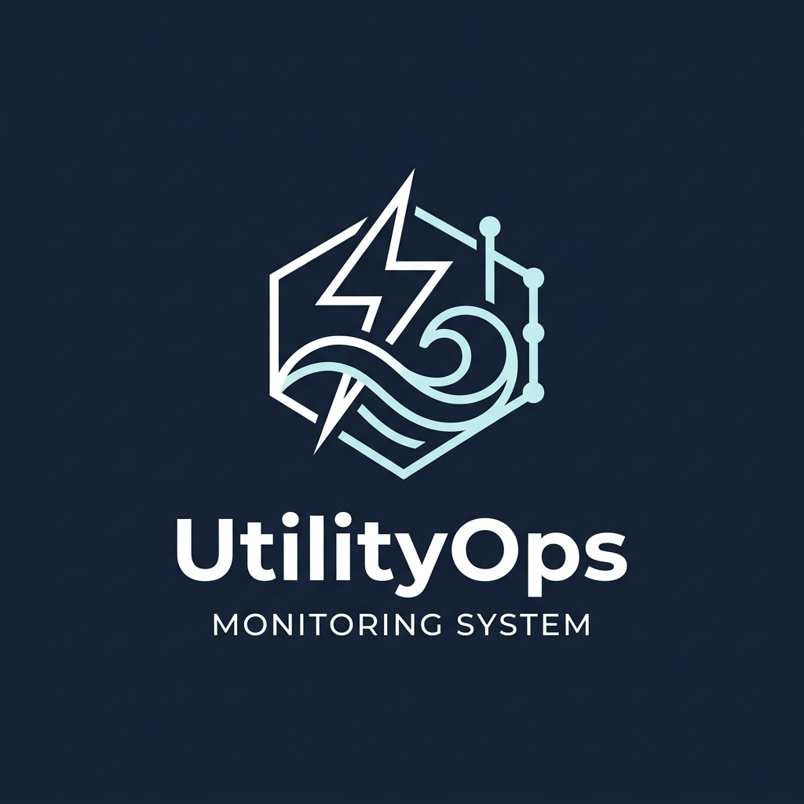

# UtilityOps Monitoring System



## About

**UtilityOps Monitoring System** is an integrated operational platform designed specifically for industrial utility management. It provides real-time monitoring, alerting, reporting, and analytics for critical utilities such as Electricity, Compressor Air, and Water.

By combining automated data collection from existing dataloggers with manual utility checks, UtilityOps creates a centralized source of truth for utility operators and engineering teams.

## Key Features

- ⚡ **Realtime Monitoring**: Seamlessly collect and visualize Electricity and Compressor data from existing dataloggers.
- 💧 **Manual Utility Check**: Input manual readings for kWh panels and water meters directly from the web interface.
- 🚨 **Abnormal Usage Alert**: Automatically detect unusual consumption patterns and trigger real-time notifications to the engineering team.
- 📊 **Automated Reporting**: Generate daily, weekly, and monthly utility reports automatically using integrated n8n automation.
- 🌓 **Sleek UI/UX**: Built with modern, responsive design including full dark/light mode support (Sleek Dark Mode and High Contrast Light Mode) and multilingual interfaces (English & Bahasa Indonesia).

## Tech Stack

This project is built with modern web technologies:
- **Framework:** React + Vite
- **Styling:** Tailwind CSS v4 + Shadcn UI
- **Icons:** Lucide React
- **Language:** TypeScript

## Quick Start

1. Clone the repository
2. Install dependencies:
   ```bash
   npm install
   ```
3. Start the development server:
   ```bash
   npm run dev
   ```

## Deployment

This application is configured for automatic deployment to GitHub Pages using:
```bash
npm run deploy
```

## License

Internal Utility Monitoring System. Authorized access only.
